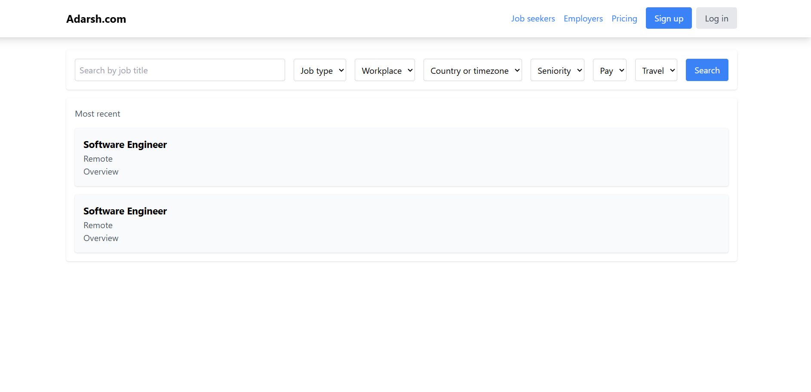
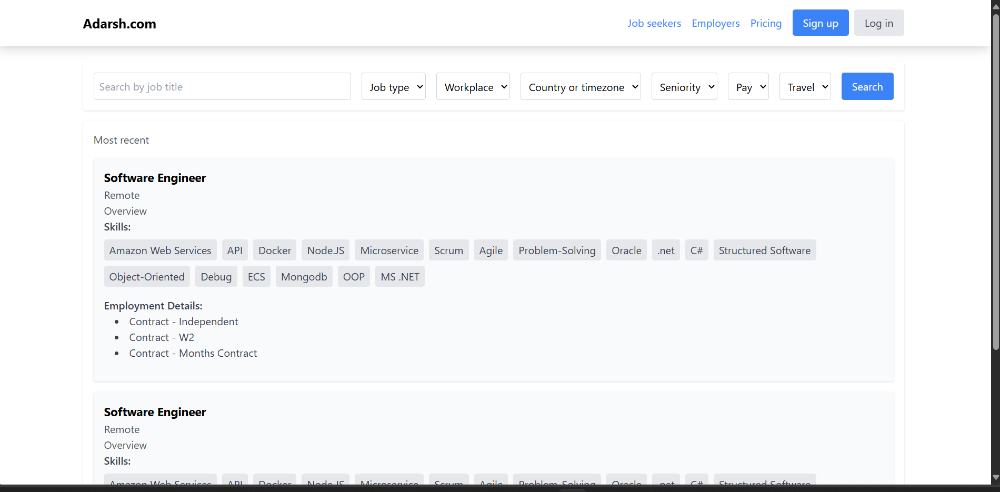

# Job Listing Application

This is a full-stack job listing application that uses Django REST Framework for the backend and Vite with React and Tailwind CSS for the frontend. The application scrapes job data from Dice.com using a Scrapy spider and stores it in a MySQL database. The frontend fetches job details from the backend and displays them in a user-friendly interface.

## Table of Contents

- [Features](#features)
- [Screenshots](#screenshots)
- [Technologies Used](#technologies-used)
- [Setup and Installation](#setup-and-installation)
- [Backend Setup](#backend-setup)
- [Frontend Setup](#frontend-setup)

## Features

- Scrapes job data from Dice.com
- Stores job data in a MySQL database
- Provides a RESTful API to fetch job details
- Displays job details in a responsive UI using React and Tailwind CSS

## Screenshots
-Front pages

  

  

## Technologies Used

### Backend

- Django
- Django REST Framework
- MySQL
- Scrapy

### Frontend

- React
- Vite
- Tailwind CSS

## Setup and Installation

### Backend Setup

